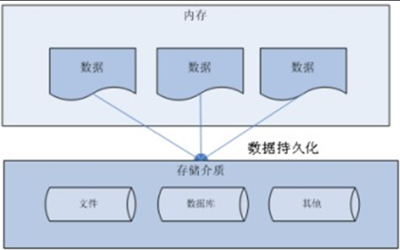
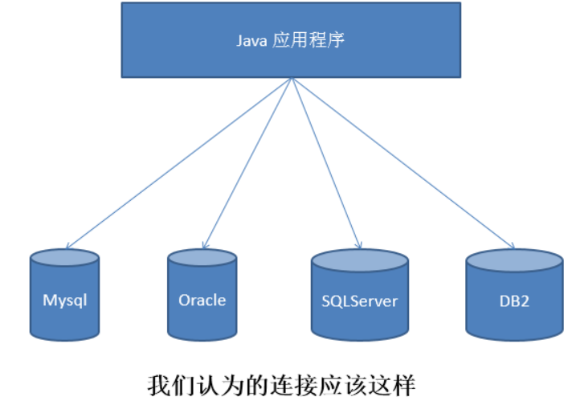
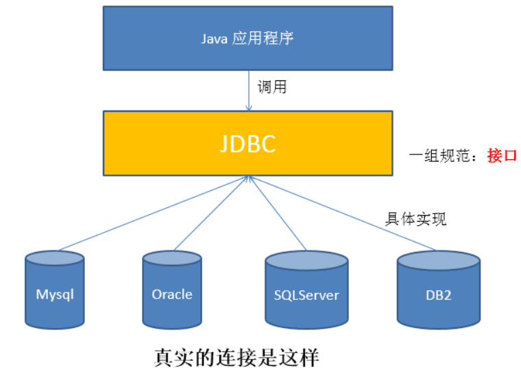
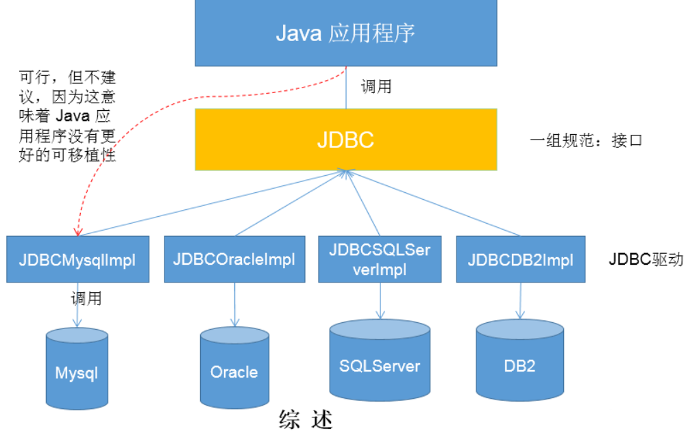
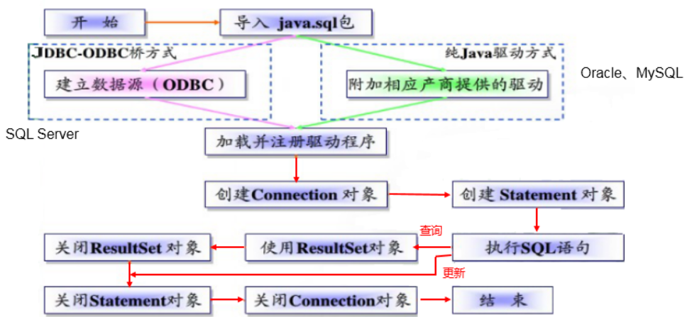
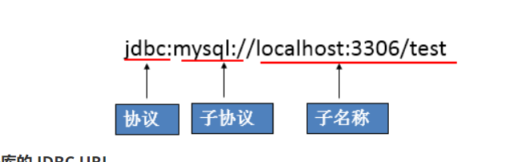

作者：纪伟

日期：2020/09/24

## 1 JDBC概述

### 1.1 数据的持久化

- 持久化(persistence)：**把数据保存到可掉电式存储设备中以供之后使用**。大多数情况下，特别是企业级应用，**数据持久化意味着将内存中的数据保存到硬盘**上加以”固化”**，而持久化的实现过程大多通过各种关系数据库来完成**。

- 持久化的主要应用是将内存中的数据存储在关系型数据库中，当然也可以存储在磁盘文件、XML数据文件中。

  

### 1.2 Java中的数据存储技术

- 在Java中，数据库存取技术可分为如下几类：
  - **JDBC**直接访问数据库
  - JDO (Java Data Object )技术
  - **第三方O/R工具**，如Hibernate, Mybatis 等
- JDBC是java访问数据库的基石，JDO、Hibernate、MyBatis等只是更好的封装了JDBC。

### 1.3 JDBC介绍

- JDBC(Java Database Connectivity)是一个**独立于特定数据库管理系统、通用的SQL数据库存取和操作的公共接口**（一组API），定义了用来访问数据库的标准Java类库，（**java.sql,javax.sql**）使用这些类库可以以一种**标准**的方法、方便地访问数据库资源。
- **JDBC：sun公司提供的一套API，使用这套API可以实现对数据库的管理操作。（获取连接、CRUD等）**
- JDBC为访问不同的数据库提供了一种**统一的途径**，为开发者屏蔽了一些细节问题。
- JDBC的目标是使Java程序员使用JDBC可以连接任何**提供了JDBC驱动程序**的数据库系统，这样就使得程序员无需对特定的数据库系统的特点有过多的了解，从而大大简化和加快了开发过程。
- 如果没有JDBC，那么Java程序访问数据库时是这样的：



------

- 有了JDBC，Java程序访问数据库时是这样的：



------

- 总结如下：



### 1.4 JDBC体系结构

- JDBC接口（API）包括两个层次：
  - **面向应用的API**：Java API，抽象接口，供应用程序开发人员使用（连接数据库，执行SQL语句，获得结果）。
  - **面向数据库的API**：Java Driver API，供开发商开发数据库驱动程序用。

> **JDBC是sun公司提供一套用于数据库操作的接口，java程序员只需要面向这套接口编程即可。**
>
> **不同的数据库厂商，需要针对这套接口，提供不同实现。不同的实现的集合，即为不同数据库的驱动。																————面向接口编程**

### 1.5 JDBC程序编写步骤



> 补充：ODBC(**Open Database Connectivity**，开放式数据库连接)，是微软在Windows平台下推出的。使用者在程序中只需要调用ODBC API，由 ODBC 驱动程序将调用转换成为对特定的数据库的调用请求。

## 2 获取数据库的连接：手写

### 2.1 概念

要获取数据库连接需要三个必要要素

- 要素一：Driver接口

  > java.sql.Driver 接口是所有 JDBC 驱动程序需要实现的接口。这个接口是提供给数据库厂商使用的，不同数据库厂商提供不同的实现。

  MySql的驱动： **com.mysql.jdbc.Driver**

  **加载与注册JDBC驱动**

  > - 加载驱动：Class.forName("com.mysql.jdbc.Driver")
  > - 注册驱动：DriverManager.registerDriver(com.mysql.jdbc.Driver)

- 要素二：url




- 要素三：用户名和密码

  > - user,password可以用“属性名=属性值”方式告诉数据库
  > - 可以调用 DriverManager 类的 getConnection() 方法建立到数据库的连接


### 方式1

```java
//1. 获取数据库连接的4个必要条件
String driverName = "com.mysql.jdbc.Driver";
String url = "jdbc:nysql://localhost:3306/test";
String name = "root";
String password = "123456";
//2. 注册驱动
Class clazz = Class.forName(driverName);
Driver driver = (Driver)clazz.newInstance();
DriverManger.registerDriver(driver);

//3. 获取连接
Connection connection = DriverManger.getConnection(url, name, password);
```

### 方式2

```java
//1. 获取数据库连接的4个必要条件
String driverName = "com.mysql.jdbc.Driver";
String url = "jdbc:mysql://localhost:3306/test";
String name = "root";
String password = "123456";
//2. 注册驱动
Class.forName(driverName);
//3. 获取连接
Connection connection = DriverManger.getConnection(url, name, password);
```

### 方式3

```java
//1. 获取数据可连接的4个必要条件：使用配置文件存储
Properties properties = new Properties();
InputStream is = Connection.class.getClassLoader().getResourceAsStream("jdbc.properties");
properties.load(is);
String driverName = properties.getProperty("driverName");
String url = properties.getProperty("url");
String name = properties.getProperty("name");
String password = properties.getProperty("password");
//2. 加载驱动类
Class.forName(driverName);
Connection connection = DriverManger.getConnection(url, name, password);
```

其中，配置文件声明在工程的src目录下：【jdbc.properties】

```properties
user=root
password=abc123
url=jdbc:mysql://localhost:3306/test
driverClass=com.mysql.jdbc.Driver
```

> 说明：使用配置文件的方式保存配置信息，在代码中加载配置文件
>
> **使用配置文件的好处：**
>
> ①实现了代码和数据的分离，如果需要修改配置信息，直接在配置文件中修改，不需要深入代码
> ②如果修改了配置信息，省去重新编译的过程。

## 3 获取数据库连接-使用数据库连接池

### 3.1 Druid（德鲁伊）简介

Druid是阿里巴巴开源平台上一个数据库连接池实现，它结合了C3P0、DBCP、Proxool等DB池的优点，同时加入了日志监控，可以很好的监控DB池连接和SQL的执行情况，可以说是针对监控而生的DB连接池，**可以说是目前最好的连接池之一。**

### 3.2 Druid数据库连接池的操作步骤

> （1）加入jar包，放在项目的lib文件夹内，然后add as library
>
> （2）代码步骤：建立一个数据库连接池
>
> ```java
> DruidDataSource source = new DruidDataSource();
> ```
>
> （3）设置连接池的参数
>
> ```java
> 基本参数有：
> source.setDriverClassName("com.mysql.jdbc.Driver");
> source.setUrl("jdbc:mysql://localhost:3306/test");
> source.setUsername("root");
> source.setPassword("123456");
> 连接参数有：
> source.setInitialSize(5);//一开始提前申请好5个连接，不够了，重写申请
> source.setMaxActive(10);//最多不超过10个，如果10都用完了，还没还回来，就会出现等待
> source.setMaxWait(1000);//用户最多等1000毫秒，如果1000毫秒还没有人还回来，就异常了
> ```
>
> （4）获取连接
>
> ```java
> Connection connection = source.getConnection();
> ```

#### 方式1：

```java
public class TestPool {
	public static void main(String[] args) throws SQLException {
		//1、创建数据源（数据库连接池）对象
		DruidDataSource ds =new DruidDataSource();
		
		//2、设置参数
		//(1)设置基本参数
		ds.setDriverClassName("com.mysql.jdbc.Driver");
		ds.setUrl("jdbc:mysql://localhost:3306/test");
		ds.setUsername("root");
		ds.setPassword("123456");
		
		//(2)设置连接数等参数
		ds.setInitialSize(5);//一开始提前申请好5个连接，不够了，重写申请
		ds.setMaxActive(10);//最多不超过10个，如果10都用完了，还没还回来，就会出现等待
		ds.setMaxWait(1000);//用户最多等1000毫秒，如果1000毫秒还没有人还回来，就异常了
		
		//3、获取连接
		for (int i = 1; i <=15; i++) {
			Connection conn = ds.getConnection();
			System.out.println("第"+i+"个：" + conn);
			
			//如果这里没有关闭，就相当于没有还
//			conn.close();#这里关闭，是还回池中
		}
	}
}
```

#### 方式2：

> - 注意1：使用当前运行时类加载properties配置文件的路径是druid.properties
>
>   ​				使用FileInputStream()时的配置文件路径是src\\druid.properties
>
> - 注意2：配置文件内的key键不能随意设置！必须符合DruidDataSource的set方法的名称
>
> - 注意3：DruidDataSource不能加载配置文件，需要使用DruidDataSourceFactory.createDataSource()方法去创建一个DruidDataSource对象。

```java
    @Test
    public void test3(){
        Connection connection = null;
        try {
            //1. 加载配置文件
            Properties properties = new Properties();
            properties.load(DruidTest.class.getClassLoader().getResourceAsStream("druid.properties"));
            //properties.load(new FileInputStream("src\\druid.properties"));
            //2. 使用配置文件返回DataSource的实例
            DataSource dataSource = DruidDataSourceFactory.createDataSource(properties);
            //3. 获取连接
            connection = dataSource.getConnection();
            System.out.println(connection);
        } catch (Exception e) {
            e.printStackTrace();
        } finally {
            try {
                connection.close();
            } catch (SQLException throwables) {
                throwables.printStackTrace();
            }
        }
    }
```


#### 其他参数

| **配置**                      | **缺省** | **说明**                                                     |
| ----------------------------- | -------- | ------------------------------------------------------------ |
| name                          |          | 配置这个属性的意义在于，如果存在多个数据源，监控的时候可以通过名字来区分开来。 如果没有配置，将会生成一个名字，格式是：”DataSource-” + System.identityHashCode(this) |
| jdbcUrl                       |          | 连接数据库的url，不同数据库不一样。例如：mysql : jdbc:mysql://10.20.153.104:3306/druid2 oracle : jdbc:oracle:thin:@10.20.149.85:1521:ocnauto |
| username                      |          | 连接数据库的用户名                                           |
| password                      |          | 连接数据库的密码。如果你不希望密码直接写在配置文件中，可以使用ConfigFilter。详细看这里：<https://github.com/alibaba/druid/wiki/%E4%BD%BF%E7%94%A8ConfigFilter> |
| driverClassName               |          | 根据url自动识别 这一项可配可不配，如果不配置druid会根据url自动识别dbType，然后选择相应的driverClassName(建议配置下) |
| initialSize                   | 0        | 初始化时建立物理连接的个数。初始化发生在显示调用init方法，或者第一次getConnection时 |
| maxActive                     | 8        | 最大连接池数量                                               |
| maxIdle                       | 8        | 已经不再使用，配置了也没效果                                 |
| minIdle                       |          | 最小连接池数量                                               |
| maxWait                       |          | 获取连接时最大等待时间，单位毫秒。配置了maxWait之后，缺省启用公平锁，并发效率会有所下降，如果需要可以通过配置useUnfairLock属性为true使用非公平锁。 |
| poolPreparedStatements        | false    | 是否缓存preparedStatement，也就是PSCache。PSCache对支持游标的数据库性能提升巨大，比如说oracle。在mysql下建议关闭。 |
| maxOpenPreparedStatements     | -1       | 要启用PSCache，必须配置大于0，当大于0时，poolPreparedStatements自动触发修改为true。在Druid中，不会存在Oracle下PSCache占用内存过多的问题，可以把这个数值配置大一些，比如说100 |
| validationQuery               |          | 用来检测连接是否有效的sql，要求是一个查询语句。如果validationQuery为null，testOnBorrow、testOnReturn、testWhileIdle都不会其作用。 |
| testOnBorrow                  | true     | 申请连接时执行validationQuery检测连接是否有效，做了这个配置会降低性能。 |
| testOnReturn                  | false    | 归还连接时执行validationQuery检测连接是否有效，做了这个配置会降低性能 |
| testWhileIdle                 | false    | 建议配置为true，不影响性能，并且保证安全性。申请连接的时候检测，如果空闲时间大于timeBetweenEvictionRunsMillis，执行validationQuery检测连接是否有效。 |
| timeBetweenEvictionRunsMillis |          | 有两个含义： 1)Destroy线程会检测连接的间隔时间2)testWhileIdle的判断依据，详细看testWhileIdle属性的说明 |
| numTestsPerEvictionRun        |          | 不再使用，一个DruidDataSource只支持一个EvictionRun           |
| minEvictableIdleTimeMillis    |          |                                                              |
| connectionInitSqls            |          | 物理连接初始化的时候执行的sql                                |
| exceptionSorter               |          | 根据dbType自动识别 当数据库抛出一些不可恢复的异常时，抛弃连接 |
| filters                       |          | 属性类型是字符串，通过别名的方式配置扩展插件，常用的插件有： 监控统计用的filter:stat日志用的filter:log4j防御sql注入的filter:wall |
| proxyFilters                  |          | 类型是List，如果同时配置了filters和proxyFilters，是组合关系，并非替换关系 |


## 4 对数据库进行增删改查CRUD操作

> 对数据库执行CRUD操作，

### 方式1：statement

```java
package com.codejiwei.day25;
import java.sql.DriverManager;
import java.sql.ResultSet;
import java.sql.SQLException;
import java.sql.Statement;

public class ConnectionTest {
    public static void main(String[] args) {
        java.sql.Connection connection = null;
        Statement statement = null;
        try {
            //1. 首先得导入一个mysql的驱动
            //2. 加载驱动
            Class.forName("com.mysql.jdbc.Driver");
            String url = "jdbc:mysql://127.0.0.1:3306/test_school";
            String name = "root";
            String password = "123456";
            //3. 创建连接对象
            //3.1 准备需要的url，user，password
            //url是协议：子协议：//ip：端口/数据库名
            connection = DriverManager.getConnection(url, name, password);
            System.out.println(connection);
            //4. 创建一个命令对象
            statement = connection.createStatement();
            //4.1 执行数据库的增删改操作executeUpdate(String sql)
//            String sql1 = "create table student(stu_id int primary key, stu_name varchar(10) not null, str_school varchar(30))";
//            String sql2 = "insert into student values(1, 'Tom', '尚硅谷'),(2, 'Jerry', '黑马')";
//            String sql3 = "update student set stu_name='Mike' where stu_id=2";
//            String sql = "delete from student where stu_id = 2";
//            statement.executeUpdate(sql);
            //4.2 执行数据的查询操作
            String sql = "select * from school";
            ResultSet resultSet = statement.executeQuery(sql);
            //显示查询结果
            while (resultSet.next()){
                System.out.print(resultSet.getString(1) + "\t");
                System.out.print(resultSet.getString(2) + "\t");
                System.out.println(resultSet.getString(3));
            }
        } catch (Exception e) {
            e.printStackTrace();
        }finally {
            try {
                connection.close();
                statement.close();
            } catch (SQLException throwables) {
                throwables.printStackTrace();
            }
        }
    }
}
```

### 方式2：statement读取properties配置文件

```java
package com.codejiwei.day25;
import java.io.IOException;
import java.io.InputStream;
import java.sql.*;
import java.util.Properties;

public class ConnectionTest1 {
    public static void main(String[] args) {
        InputStream is = null;
        Connection connection = null;
        Statement statement = null;
        try {
            //使用配置文件的方式创建连接
            Properties properties = new Properties();
            is = ConnectionTest1.class.getClassLoader().getResourceAsStream("jdbc.properties");
            properties.load(is);
            //获取配置文件内的内容
            String className = properties.getProperty("className");
            String url = properties.getProperty("url");
            String name = properties.getProperty("name");
            String password = properties.getProperty("password");
            //2. 加载驱动
            Class.forName(className);
            //3. 创建connection对象
            connection = DriverManager.getConnection(url, name, password);
            System.out.println(connection);
            //4. 创建statement对象
            statement = connection.createStatement();
            //4.1 sql语句
            String sql = "select * from customers";
            ResultSet resultSet = statement.executeQuery(sql);
            //4.2 显示查询结果
            while (resultSet.next()){
                System.out.print(resultSet.getString(1) + "\t");
                System.out.print(resultSet.getString(2) + "\t");
                System.out.print(resultSet.getString(3) + "\t");
                System.out.println(resultSet.getString(4));
            }
        } catch (IOException e) {
            e.printStackTrace();
        } catch (ClassNotFoundException e) {
            e.printStackTrace();
        } catch (SQLException throwables) {
            throwables.printStackTrace();
        } finally {
            try {
                connection.close();
                is.close();
                statement.close();
            } catch (Exception throwables) {
                throwables.printStackTrace();
            }
        }
    }
}
```

### 方式3 preparedStatement

> - 解决sql拼接和sql注入的问题
>
>   - 拼接问题
>
>   ```java
>   String sql = "insert into t_employee(ename,tel,gender,salary) values('" + ename + "','" + tel + "','" + gender + "'," + salary +")";
>   Statement st = conn.createStatement();
>   int len = st.executeUpdate(sql);
>   ```
>
>   - 注入问题
>
>   ```java
>   String sql = "SELECT * FROM t_employee where ename='" + ename + "'";
>   //如果我此时从键盘输入ename值的时候，输入：张三' or '1'= '1
>   //结果会把所有数据都查询出来
>   Statement st = conn.createStatement();
>   ResultSet rs = st.executeQuery(sql);
>   ```

```java
    @Test
    public void test1(){
        Connection connection = null;
        PreparedStatement preparedStatement = null;
        try {
            //使用配置文件获取连接要素
            Properties properties = new Properties();
            properties.load(new FileInputStream("src\\jdbc1.properties"));

            //获取内容
            String driverName = properties.getProperty("driverName");
            String url = properties.getProperty("url");
            String username = properties.getProperty("username");
            String password = properties.getProperty("password");

            //加载驱动
            Class.forName(driverName);
            //获取connection连接
            connection = DriverManager.getConnection(url, username, password);
            //创建命令对象
            //进行sql语句的预编译
            String sql = "insert into employee values (null ,?,?)";
            preparedStatement = connection.prepareStatement(sql);
            preparedStatement.setString(1, "Mike");
            preparedStatement.setString(2, "20000");

            int i = preparedStatement.executeUpdate();
            System.out.println(i);
        } catch (IOException e) {
            e.printStackTrace();
        } catch (ClassNotFoundException e) {
            e.printStackTrace();
        } catch (SQLException throwables) {
            throwables.printStackTrace();
        } finally {
            try {
                connection.close();
                preparedStatement.close();
            } catch (SQLException throwables) {
                throwables.printStackTrace();
            }
        }
    }
```

### 方式4：preparedStatement读取properties配置文件

```java
    public static void main(String[] args) throws Exception {
        Properties properties = new Properties();
        properties.load(new FileInputStream("jdbc.properties"));
        DruidDataSource source = (DruidDataSource) DruidDataSourceFactory.createDataSource(properties);
        DruidPooledConnection connection = source.getConnection();
        System.out.println(connection);
    }
```


### 4.1 update操作

```java
    public static void main(String[] args) throws Exception {
        Properties properties = new Properties();
        properties.load(new FileInputStream("jdbc.properties"));
        DataSource dataSource = DruidDataSourceFactory.createDataSource(properties);
        Connection connection = dataSource.getConnection();

        String sql = "insert into user values(null,?,?,?,?)";
        PreparedStatement preparedStatement = connection.prepareStatement(sql);
        preparedStatement.setString(1, "蔡卓妍");
        preparedStatement.setString(2, "12344");
        preparedStatement.setString(3, "中国");
        preparedStatement.setString(4, "345532");
        
        int i = preparedStatement.executeUpdate();
        System.out.println(i);
    }
```


### 4.2 query操作

```java
    public static void main(String[] args) throws Exception {
        Properties properties = new Properties();
        properties.load(new FileInputStream("jdbc.properties"));
        DruidDataSource source = (DruidDataSource) DruidDataSourceFactory.createDataSource(properties);
        DruidPooledConnection connection = source.getConnection();
        System.out.println(connection);

        String sql = "select name, address from user where id=?";
        PreparedStatement preparedStatement = connection.prepareStatement(sql);
        preparedStatement.setString(1, "4");
        ResultSet resultSet = preparedStatement.executeQuery();
        while (resultSet.next()){
            System.out.println(resultSet.getString(1));
            System.out.println(resultSet.getString(2));
        }
    }
```


### 4.3 批处理任务

#### 不使用批处理添加10000条数据

```java
    @Test
    public void test2(){
        long start = System.currentTimeMillis();
        Connection connection = null;
        PreparedStatement preparedStatement = null;
        try {
            //使用Properties获取配置文件
            Properties properties = new Properties();
            properties.load(new FileInputStream("src\\jdbc1.properties"));
            //获取配置文件中的内容
            String driverName = properties.getProperty("driverName");
            String url = properties.getProperty("url");
            String username = properties.getProperty("username");
            String password = properties.getProperty("password");
            //加载驱动
            Class.forName(driverName);
            //创建connection对象
            connection = DriverManager.getConnection(url, username, password);
            //创建prepareStatement对象
            //预编译sql语句
            String sql = "insert into customer values(null ,?,?,?)";
            preparedStatement = connection.prepareStatement(sql);
            //批量添加数据
            for (int i = 0; i <= 10000; i++) {
                preparedStatement.setString(1, "Tom"+i);
                preparedStatement.setString(2, "23");
                preparedStatement.setString(3, "男");
                //添加完一条消息后就执行以此提交
                preparedStatement.executeUpdate();
            }
        } catch (IOException e) {
            e.printStackTrace();
        } catch (ClassNotFoundException e) {
            e.printStackTrace();
        } catch (SQLException throwables) {
            throwables.printStackTrace();
        } finally {
            try {
                preparedStatement.close();
                connection.close();
            } catch (SQLException throwables) {
                throwables.printStackTrace();
            }
        }
        long end = System.currentTimeMillis();
        //计算批量添加10000条数据所用的时间
        System.out.println(end - start);//13465
    }
```

#### 使用批处理添加10000条数据

```java
    @Test
    public void test3(){
        long start = System.currentTimeMillis();
        Connection connection = null;
        PreparedStatement preparedStatement = null;
        try {
            //使用Properties加载配置文件
            Properties properties = new Properties();
            properties.load(new FileInputStream("src\\jdbc1.properties"));
            //获取配置文件中的内容
            String driverName = properties.getProperty("driverName");
            String url = properties.getProperty("url");
            String username = properties.getProperty("username");
            String password = properties.getProperty("password");
            //加载Driver
            Class.forName(driverName);
            //创建connection对象
            connection = DriverManager.getConnection(url, username, password);
            //创建prepareStatement
            //预编译sql
            String sql = "insert into customer values(null ,?,?,?)";
            preparedStatement = connection.prepareStatement(sql);
            //批量添加10000条数据
            //批处理操作的条件
            //1. 需要在driverName的后面加上?rewriteBatchedStatements=true
            for (int i = 0; i <= 10000; i++) {
                preparedStatement.setString(1, "Jerry"+i);
                preparedStatement.setString(2, "23");
                preparedStatement.setString(3, "男");
                //可以攒一部分再处理
                preparedStatement.addBatch();
                if (i % 1000 == 0){
                    //执行
                    preparedStatement.executeBatch();
                    //清空
                    preparedStatement.clearBatch();
                }
            }
            //如果在这个地方执行executeBatch()，是攒10000条数据后，执行
//        preparedStatement.executeBatch();
        } catch (IOException e) {
            e.printStackTrace();
        } catch (ClassNotFoundException e) {
            e.printStackTrace();
        } catch (SQLException throwables) {
            throwables.printStackTrace();
        } finally {
            //关闭资源
            try {
                preparedStatement.close();
                connection.close();
            } catch (SQLException throwables) {
                throwables.printStackTrace();
            }
        }
        long end = System.currentTimeMillis();
        System.out.println(end - start);//373
    }
```


### 4.4 事务

```java
    public static void main(String[] args) {
        Connection connection = null;
        PreparedStatement preparedStatement = null;
        try {
            //使用配置文件
            Properties properties = new Properties();
            properties.load(new FileInputStream("day0923\\src\\jdbc.properties"));

            //加载配置文件中的内容
            String driverName = properties.getProperty("className");
            String url = properties.getProperty("url");
            String username = properties.getProperty("name");
            String password = properties.getProperty("password");
            //加载驱动
            Class.forName(driverName);
            //创建connection对象
            connection = DriverManager.getConnection(url, username, password);
            
            //1. 开启事务(关闭自动提交)
            connection.setAutoCommit(false);

            //创建prepareStatement
            //预编译sql
            String sql = "update employee set money=? where id =1";
            String sql2 = "update employee set money=? where id=2";
            preparedStatement = connection.prepareStatement(sql);
            preparedStatement.setString(1, "7000");
            int i = preparedStatement.executeUpdate();
            System.out.println("第一条：" + (i>0?"成功":"失败"));

            int i2 = 1 / 0;

            preparedStatement = connection.prepareStatement(sql2);
            preparedStatement.setString(1, "3000");
            int i1 = preparedStatement.executeUpdate();
            System.out.println("第二条：" + (i1>0?"成功":"失败"));

            //2. 如果都成功了就提交事务
            connection.commit();

        } catch (Exception e) {
            e.printStackTrace();

            //3. 如果失败了那就回滚
            try {
                connection.rollback();
            } catch (SQLException throwables) {
                throwables.printStackTrace();
            }

        }finally {
            try {
                preparedStatement.close();

                //好的习惯是关闭之前要把重新修改为自动提交
                connection.setAutoCommit(true);

                connection.close();
            } catch (SQLException throwables) {
                throwables.printStackTrace();
            }
        }
    }
```


## 5 封装JDBCTools

### 5.1 使用Druid数据库连接池的当时去封装JDBCTools

> - 注意1:将DataSource放在方法内，外部每次调用都会创建一个池子，这样还不如单次获取connection对象，所以需要将创建DataSource提到方法外，将DataSource作为静态私有属性，然后其他的操作放在静态代码块中，这样就会只有一个池子，并且静态代码块中还可以处理异常。

```java
package com.codejiwei.demo;
import com.alibaba.druid.pool.DruidDataSourceFactory;
import javax.sql.DataSource;
import java.io.FileInputStream;
import java.io.IOException;
import java.sql.Connection;
import java.util.Properties;

public class JDBCTools {

    private static DataSource dataSource;

    //放在静态代码块中
    static {
        //1.加载配置文件
        Properties properties = new Properties();
        try {
            properties.load(new FileInputStream("day0923\\src\\druid.properties"));
        } catch (IOException e) {
            e.printStackTrace();
        }
        //2. 获取数据库连接池(使用Druid数据库连接池就不用设置参数了，但是配置文件内的key必须合法)
        //需要说明的是！在测试类中每次获取connection对象这样都会创建一个池子！这样更浪费资源！
        //所以需要将dataSource提到静态代码块中，这样还可以处理异常。
        try {
            dataSource = DruidDataSourceFactory.createDataSource(properties);
        } catch (Exception e) {
            e.printStackTrace();
        }
    }

    /**
     * @Author jiWei
     * @Date 21:26 2020/9/24
     * @Description //TODO 获取连接的方法
     * @Params 
     * @return 
     */
    public static Connection getConnection() throws Exception {
        
        Connection connection = dataSource.getConnection();
        
        return connection;
    }
     /**
     * @Author jiWei
     * @Date 23:47 2020/9/24
     * @Description //TODO 关闭connection连接的方法
     * @Params
     * @return
     */
    public static void closeConnection(Connection connection){
        if (connection != null){
            try {
                connection.close();
            } catch (SQLException throwables) {
                throwables.printStackTrace();
            }
        }
    }

}
```

### 5.2 使用JDBCTools去执行CRUD操作

```java
    public static void main(String[] args) {
        //使用封装好的JDBCTools中静态的getConnection()获取connection对象
        Connection connection = JDBCTools.getConnection();
        String sql = "select * from user where id=?";
        try {
            PreparedStatement preparedStatement = connection.prepareStatement(sql);
            preparedStatement.setString(1, "5");
            //执行查询操作
            ResultSet resultSet = preparedStatement.executeQuery();
            if (resultSet.next()){
                System.out.print(resultSet.getString(2) + "\t");
                System.out.print(resultSet.getString(3) + "\t");
                System.out.print(resultSet.getString(4) + "\t");
                System.out.print(resultSet.getString(5));
            }
        } catch (SQLException throwables) {
            throwables.printStackTrace();
        }
        //使用封装好的JDBCTools中静态的closeConnection()关闭connection对象
        JDBCTools.closeConnection(connection);
    }
```


## 6 DBUtils

### 6.1 Apache-DBUtils简介

commons-dbutils 是 Apache 组织提供的一个开源 JDBC工具类库，它是对JDBC的简单封装，学习成本极低，并且使用dbutils能极大简化jdbc编码的工作量，同时也不会影响程序的性能。

其中QueryRunner类封装了SQL的执行，是线程安全的。

### 6.2 使用DBUtils对数据表执行CRUD操作

#### 前提

导入数据；导入dbutils的jar包

提供javabean：Customer类

```java
/**
 * ORM（object relational mapping)的编程思想
 * 数据库中的一个表与java中的一个类对应
 * 数据表的一行与java类的一个对象对应
 * 数据表的一列与java类的一个属性对应
 *
 * @author shkstart
 * @create 2020 下午 2:42
 */
public class Customer {

    private int id;
    private String name;
    private String email;
    private Date birth;

    @Override
    public String toString() {
        return "Customer{" +
                "id=" + id +
                ", name='" + name + '\'' +
                ", email='" + email + '\'' +
                ", birth=" + birth +
                '}';
    }

    public int getId() {
        return id;
    }

    public void setId(int id) {
        this.id = id;
    }

    public String getName() {
        return name;
    }

    public void setName(String name) {
        this.name = name;
    }

    public String getEmail() {
        return email;
    }

    public void setEmail(String email) {
        this.email = email;
    }

    public Date getBirth() {
        return birth;
    }

    public void setBirth(Date birth) {
        this.birth = birth;
    }

    public Customer(int id, String name, String email, Date birth) {
        this.id = id;
        this.name = name;
        this.email = email;
        this.birth = birth;
    }

    public Customer() {
    }
}
```

#### 添加数据


#### 删除数据


#### 修改数据


#### 查询数据

> 根据查询结果可以分为BeanHandler、BeanListHandler、MapHandler，ScalarHandle


## 7 BaseDao封装


## 使用JDBC模拟用户登录注册模块

> - bean:
> - viewTest
> - service


### bean

```java
package com.codejiwei.homework.bean;

public class User {
    private int id;
    private String username;
    private String password;
    private String name;
    private int age;
    public User() {
    }
    public User(int id, String username, String password, String name, int age) {
        this.id = id;
        this.username = username;
        this.password = password;
        this.name = name;
        this.age = age;
    }
    public int getId() {
        return id;
    }
    public void setId(int id) {
        this.id = id;
    }

    public String getUsername() {
        return username;
    }
    public void setUsername(String username) {
        this.username = username;
    }
    public String getPassword() {
        return password;
    }
    public void setPassword(String password) {
        this.password = password;
    }
    public String getName() {
        return name;
    }
    public void setName(String name) {
        this.name = name;
    }
    public int getAge() {
        return age;
    }
    public void setAge(int age) {
        this.age = age;
    }
    @Override
    public String toString() {
        return "User{" +
                "id=" + id +
                ", username='" + username + '\'' +
                ", password='" + password + '\'' +
                ", name='" + name + '\'' +
                ", age=" + age +
                '}';
    }
}
```

### UserService

```java
package com.codejiwei.homework.service;

import com.codejiwei.homework.bean.User;

import java.sql.*;

/**
 * @Author jiweicode
 * @Date 2020/9/24 - 10:25
 * @Version 1.0
 * @Description
 **/
public class UserService {
    /**
     * @Author jiWei
     * @Date 10:25 2020/9/24
     * @Description //TODO 用户注册操作
     * @Params
     * @return
     */
    public boolean userRegister(User user){
        Connection connection = null;
        Statement statement = null;
        try {
            //1. 获取mysql驱动
            Class.forName("com.mysql.jdbc.Driver");
            //2. 创建connection对象
            String url = "jdbc:mysql://localhost:3306/day03_homework";
            String root = "root";
            String pd = "123456";
            connection = DriverManager.getConnection(url, root, pd);
            //3. 创建statement对象
            statement = connection.createStatement();
            //4. sql语句,插入数据
            String sql = "insert into user values (null ,'" + user.getUsername()+ "','" +user.getPassword() +"','"+user.getName()+"',"+user.getAge()+")";
            statement.executeUpdate(sql);

        } catch (Exception e) {
            e.printStackTrace();
        }finally {
            try {
                connection.close();
                statement.close();
            } catch (SQLException throwables) {
                throwables.printStackTrace();
            }

        }

        return true;
    }
    /**
     * @Author jiWei
     * @Date 10:26 2020/9/24
     * @Description //TODO 用户登录操作
     *                使用select语句查询表中是否含有该用户
     * @Params
     * @return
     */
    public User userLogin(String username, String password){
        Connection connection = null;
        Statement statement = null;
        ResultSet resultSet = null;
        try {
            //1. 获取驱动
            Class.forName("com.mysql.jdbc.Driver");
            //2. 创建connection对象
            connection = DriverManager.getConnection("jdbc:mysql://localhost:3306/day03_homework", "root", "123456");
            //3. 创建statement对象
            statement = connection.createStatement();
            //4. 执行sql语句
            String sql = "select * from user where username='"+username+"'and password='"+password+"'";
            resultSet = statement.executeQuery(sql);
            if (resultSet.next()){
                int id = resultSet.getInt(1);
                String username1 = resultSet.getString(2);
                String password1 = resultSet.getString(3);
                String name = resultSet.getString(4);
                int age = resultSet.getInt(5);
                User user = new User(id, username1, password1, name, age);
                return user;
            }else
                return null;


        } catch (Exception e) {
            e.printStackTrace();
        }finally {
            try {
                connection.close();
                statement.close();
                resultSet.close();
            } catch (SQLException throwables) {
                throwables.printStackTrace();
            }
        }
        return null;
    }
}
```

### view和test

```java
package com.codejiwei.homework.view;

import com.codejiwei.homework.bean.User;
import com.codejiwei.homework.service.UserService;

import java.util.Scanner;

/**
 * @Author jiweicode
 * @Date 2020/9/24 - 9:29
 * @Version 1.0
 * @Description
 * 使用数据库模拟登录注册
 **/
public class Test {
    private static Scanner scanner = new Scanner(System.in);
    private static UserService service = new UserService();
    public static void main(String[] args) {
        menu();
    }
    public static void menu(){
        boolean loop = true;
        do {
            System.out.println("欢迎来到尚硅谷 1.登录 2.注册 3.退出");
            int key = scanner.nextInt();
            switch (key){
                case 1:
                    //登录
                    login();
                    break;
                case 2:
                    //注册
                    register();
                    break;
                case 3:
                    System.out.println("确认是否退出？(Y/N)");
                    String quit = scanner.next();
                    if ("y".equals(quit.toLowerCase()))
                        loop = false;
                    break;
            }

        }while (loop);
    }
    /**
     * @Author jiWei
     * @Date 10:19 2020/9/24
     * @Description //TODO 登录
     * @Params
     * @return
     */
    public static void login(){
        System.out.print("请输入用户名：");
        String username = scanner.next();
        System.out.print("请输入密码：");
        String password = scanner.next();
        User user = service.userLogin(username, password);
        if (user != null)
            System.out.println("欢迎"+user.getName());
        else
            System.out.println("用户名或密码错误");
    }
    /**
     * @Author jiWei
     * @Date 10:20 2020/9/24
     * @Description //TODO 注册
     * @Params
     * @return
     */
    public static void register(){
        System.out.print("请输入用户名：");
        String username = scanner.next();
        System.out.print("请输入密码：");
        String password = scanner.next();
        System.out.print("请输入姓名：");
        String name = scanner.next();
        System.out.print("请输入年龄：");
        int age = scanner.nextInt();
        User user = new User(0, username, password, name, age);
        //注册操作：
        boolean b = service.userRegister(user);
        if (b)
            System.out.println("注册成功");
        else
            System.out.println("注册失败");
    }
}
```

